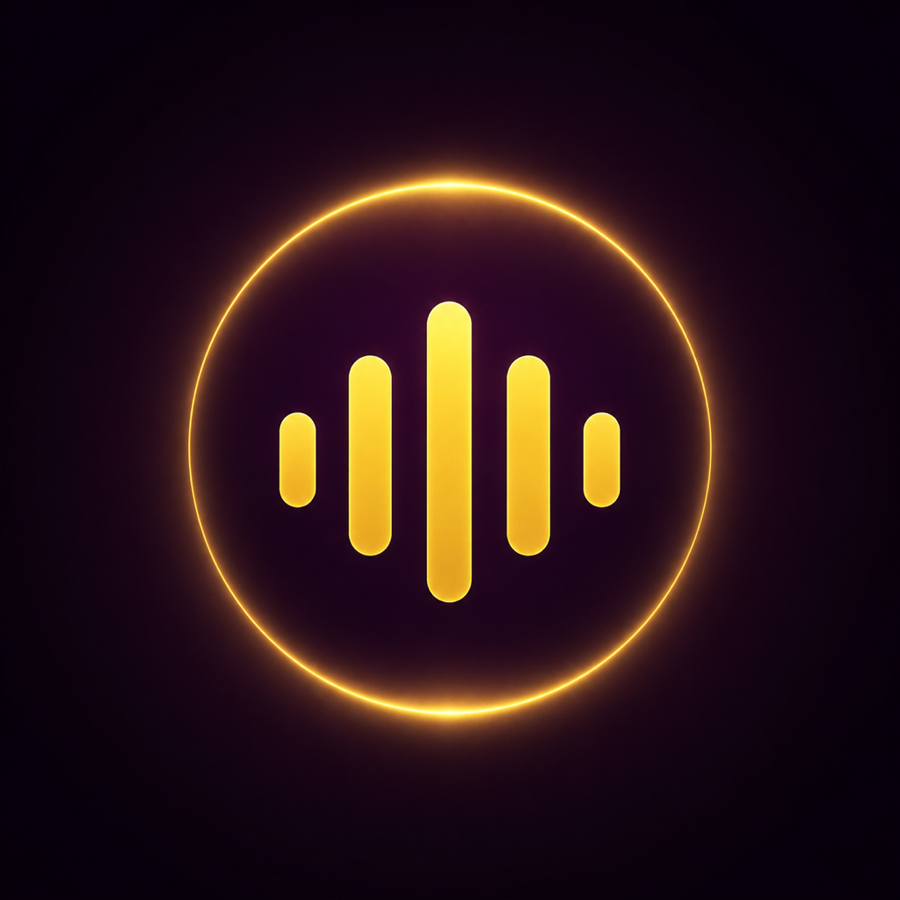

  

# OutLoud

OutLoud adds a deliberate pause before distracting apps. Choose the apps you want to protect, set an intention, and say it aloud before continuing.

## How it works

1. OutLoud uses Apple's Screen Time picker to protect apps selected by the user.
2. Opening a protected app presents a system-managed OutLoud shield.
3. Tapping Unlock opens OutLoud's focused voice screen on iOS 26.5 or newer.
4. Speaking the chosen phrase creates a temporary access window and automatically returns to a configured app.
5. An optional Shortcuts automation re-arms protection after the user leaves the selected app.

App identities are represented by opaque Apple tokens. OutLoud has no account, analytics, advertising, tracking, or backend service.

## Technology

- SwiftUI
- Family Controls
- Managed Settings and Managed Settings UI
- Device Activity
- Speech and AVFoundation
- App Intents for the automatic re-arm shortcut
- App Group storage shared with three Screen Time extensions

## Requirements

- Xcode 26 or newer is recommended.
- iOS 17 or newer; iOS 26.5 or newer provides the cleanest shield-to-app handoff.
- A physical iPhone for Screen Time integration testing.
- An Apple Developer Program team for the complete device build.

## Build on an iPhone

See [INSTALL_ON_IPHONE.md](INSTALL_ON_IPHONE.md). The short version is:

1. Open `OutLoud.xcodeproj`.
2. Select the same development team for the app, test target, and all three extensions.
3. Connect an unlocked iPhone and select it as the run destination.
4. Press **Run** (`Command-R`).

Screen Time shields cannot be meaningfully tested in Simulator. Simulator builds use sample apps and a simulated phrase match for UI development.

## Tests and logs

Run tests with **Product > Test** (`Command-U`) while a supported destination is selected. Development and unified-logging instructions are in [DEVELOPMENT.md](DEVELOPMENT.md).

## App Store status

The project is being prepared for its first App Store release. Distribution requires Apple to approve the Family Controls entitlement for the main app and each Screen Time extension. Submission notes and draft metadata live in [AppStore](AppStore/).

## Privacy

OutLoud does not collect data. See the public [privacy policy](docs/privacy.md) and the bundled privacy manifest at [PrivacyInfo.xcprivacy](Shared/PrivacyInfo.xcprivacy).

## Contributing

Issues and focused pull requests are welcome. Please read [CONTRIBUTING.md](CONTRIBUTING.md) before submitting a change.

No open-source license has been granted yet. The repository is public for transparency and collaboration; copyright remains with the author.
